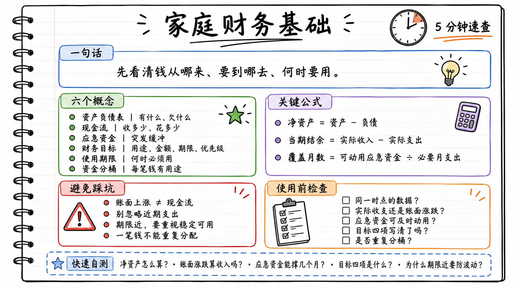

# 家庭财务基础：5 分钟速查表

> 用途：在安排一笔钱之前，快速确认它从哪里来、何时要用、能否承担波动，以及是否已被重复分配。



## 一句话定义

家庭财务管理，是先看清家庭的资产、负债与现金流，再按目标和使用期限为资金安排用途，避免在需要用钱时资金不足。

## 六个核心概念

| 概念 | 最简单的理解 | 关键问题 |
|---|---|---|
| 资产负债表 | 某一时点“有什么、欠什么” | 我的净资产和流动资金够吗？ |
| 现金流 | 一段时间“收多少、花多少” | 每月结余是否真实、稳定？ |
| 应急资金 | 给突发事件留的缓冲 | 能覆盖几个月必要支出？ |
| 财务目标 | 未来某时需要钱做的具体事 | 用途、金额、期限、优先级是什么？ |
| 使用期限 | 这笔钱什么时候必须用 | 到期时能否稳定、按时可用？ |
| 资金分桶 | 让每笔钱有明确用途 | 是否一笔钱被分给了两个目标？ |

## 关键规则与公式

- `净资产 = 资产 − 负债`
- `当期结余 = 当期实际收入 − 当期实际支出`
- `应急资金可覆盖月数 = 可随时动用的应急资金 ÷ 每月必要支出`
- 账面涨跌不是现金流：未卖出的基金或房产上涨，不等于当月可花的钱。
- 期限越近、用途越刚性，越要优先关注资金的稳定性和可用性。
- 分桶按“用途 + 期限”划分，不按“存款、基金等产品名称”划分。
- 一笔钱只能分配一次；分桶合计不能超过实际可安排资金。

## 心智模型：先问六个问题

```text
有一笔钱 / 要做一项支出
            ↓
1. 这是资产、负债，还是一段期间的收支？
            ↓
2. 是实际到账或实际支付的吗？
            ↓
3. 是否为突发事件预留了可及时动用的缓冲？
            ↓
4. 这笔钱的用途、金额、期限、优先级是什么？
            ↓
5. 什么时候必须用？到期日能承受多大波动？
            ↓
6. 它属于哪个桶？是否与其他目标重复占用？
```

## 4 个虚构例子

1. **算净资产**：资产 173 万元、负债 91 万元，净资产是 `82 万元`；但仍要看其中有多少能及时动用。
2. **算现金流**：月收入 2 万元，日常支出 1.2 万元，年度保险费 0.6 万元，当月真实结余是 `0.2 万元`，不是 0.8 万元。
3. **算应急缓冲**：可随时动用 5 万元，每月必要支出 1 万元，可覆盖 `5 个月`。
4. **避免重复分配**：可动用存款 5 万元，不能同时完整记为“应急资金 5 万元”和“换车资金 5 万元”。

## 常见误区

- 只看净资产总额，忽略现金不足、还款压力和资金流动性。
- 将投资账户的账面上涨当成可支配收入。
- 把已有明确用途的资金也算入应急资金。
- 认为所有目标都同等紧急，或目标变化后不重新排序。
- 因短期收益机会，忽略资金很快需要使用。
- 用产品名称代替用途分类，或让同一笔钱服务多个目标。

## 使用前检查

- [ ] 我使用的是同一时点的资产与负债数据吗？
- [ ] 我区分了实际现金收支和账面价值变动吗？
- [ ] 近期必要支出和还款是否已有资金安排？
- [ ] 应急资金是否未被其他目标占用，且可及时使用？
- [ ] 目标是否写清用途、金额、期限和优先级？
- [ ] 每笔资金是否只属于一个用途桶？
- [ ] 如果目标提前、推迟或金额变化，我是否重新检查了安排？

## 5 个快速自测

1. 资产 50 万元、负债 18 万元，净资产是多少？
2. 基金账面上涨但未卖出，属于当月现金流收入吗？
3. 可动用应急资金 6 万元、必要月支出 1.5 万元，可覆盖几个月？
4. 一个清晰的财务目标应包括哪四项信息？
5. 为什么一笔半年后必须使用的钱，需要特别关注其短期波动？

<details>
<summary>自测答案</summary>

1. 32 万元。
2. 不属于；它是资产价值变动。
3. 4 个月。
4. 事项、金额、期限、优先级。
5. 若临近使用时价值下跌，可能无法按时足额支付，并被迫在不利时处理资产。

</details>
